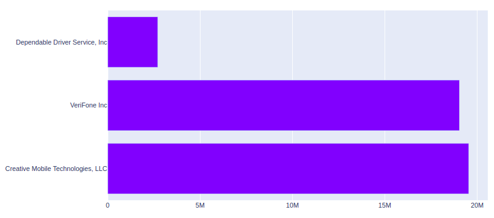
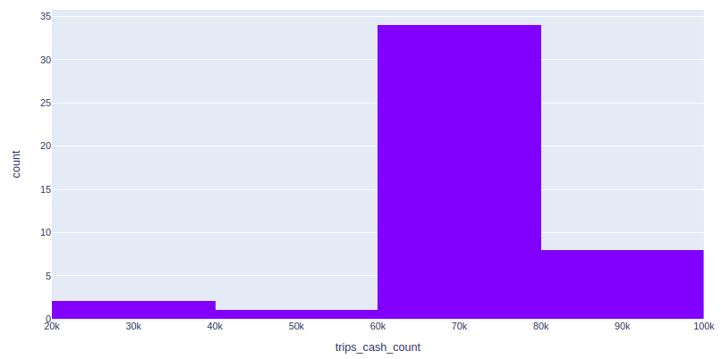
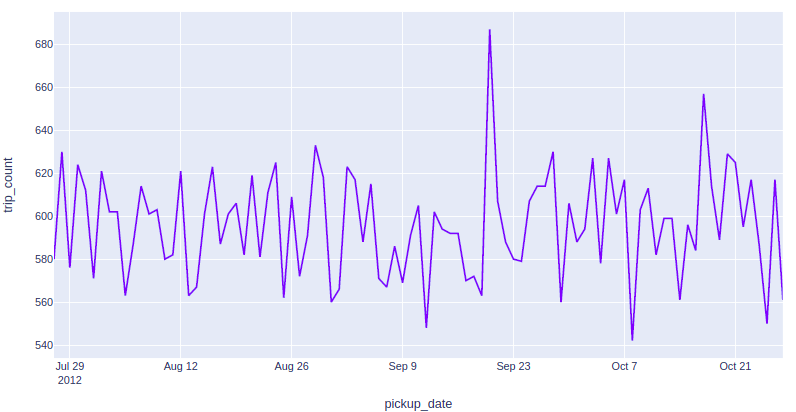

# NYC TAXI TRIPS

Análise de base de dados de corrida de taxi em Nova York no período de 2009 a 2012, considerando caracteŕisticas como tempo entre corridas, existência de gorjetas, valores em dinheiro, volume de corridas por mês ou dia.

## Preparação de dados

Os dados foram extraídos da base disponibilizada, compactados em formato BZ2 (bzip), armazenados no bucket storage da AWS S3 e consumidos a partir do AWS Athena (este realiza a leitura a partir do storage). Ao armazenar o dado compactado reduz-se a tranferência de dados e custo de  consumo deste dado inclusive no AWS Athena.

A compactação foi realizada via command no Linux (arquivos na pasta local "data"):

- bzip2 -c data/data-payment_lookup-csv.csv > data/payment.bz2
- bzip2 -c data/data-vendor_lookup-csv.csv > data/vendor.bz2
- bzip2 -c data/data-sample_data-nyctaxi-trips-2009-json_corrigido.json > data/trips2009.bz2
- bzip2 -c data/data-sample_data-nyctaxi-trips-2010-json_corrigido.json > data/trips2010.bz2
- bzip2 -c data/data-sample_data-nyctaxi-trips-2011-json_corrigido.json > data/trips2011.bz2
- bzip2 -c data/data-sample_data-nyctaxi-trips-2012-json_corrigido.json > data/trips2012.bz2

A criação e atualização no bucket foi realizada utilizando comandos AWS CLI (AWS Command Line Interface, autenticado localmente):

- aws s3api create-bucket --bucket ytbd-nyctaxi
- aws s3 cp data/payment.bz2 s3://ytbd-nyctaxi/payment/payment.bz2
- aws s3 cp data/vendor.bz2 s3://ytbd-nyctaxi/vendor/vendor.bz2
- aws s3 cp data/trips2009.bz2 s3://ytbd-nyctaxi/trips/trips2009.bz2
- aws s3 cp data/trips2010.bz2 s3://ytbd-nyctaxi/trips/trips2010.bz2
- aws s3 cp data/trips2011.bz2 s3://ytbd-nyctaxi/trips/trips2011.bz2
- aws s3 cp data/trips2012.bz2 s3://ytbd-nyctaxi/trips/trips2012.bz2

## Preparação do banco de dados

A criação do database e das tabelas foram realizadas em python utilizando médodos da biblioteca boto3, aplicando scripts/querys no formato do Athena (baseado em Presto) para fontes de dados em CSV (forma de pagamentos e empresas de taxi) e JSON (viagens).

Os logs e execuções do Athena são armazenados na pasta "s3://ytbd-nyctaxi/athena/".

**Database: nyctaxi**

**Tabela payment:** payment_type, payment_lookup

**Tabela vendor:** vendor_id, name, address, city, state, zip, country, contact, current_contact

**Tabela trips:** vendor_id, pickup_datetime, dropoff_datetime, passenger_count,trip_distance, pickup_longitude, pickup_latitude, rate_code, store_and_fwd_flag, dropoff_longitude, dropoff_latitude, payment_type, fare_amount, surcharge, tip_amount, tolls_amount, total_amount

## Resultados

Distância média percorrida por viagens com no máximo 2 passageiros: **2.66**

Tempo médio em minutos de corridas no fim de semana (sábado e domingo): **8.74**

Maiores vendors em valor total arrecadado:

Quantidades de corridas por mês pagas em dinheiro:

Quantidades de corridas com gorjeta por dia dos últimos 3 meses com dados de 2012:

